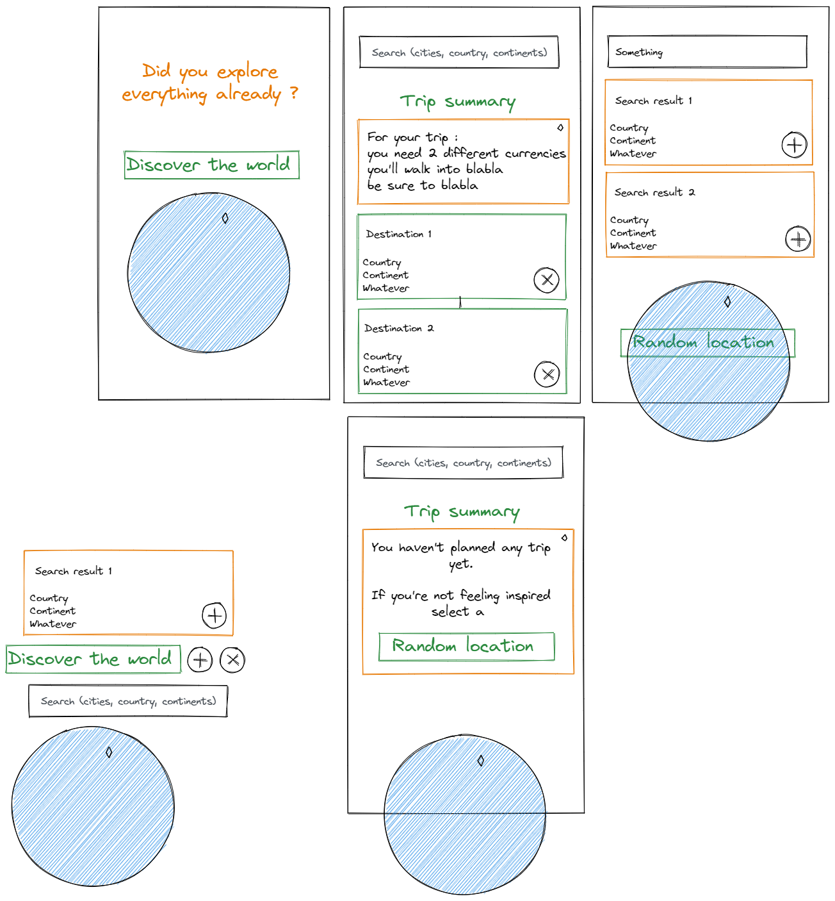

# Work summary

## GraphQl and Typescript

When I'm facing a project that use the graphQl technology,
I'm taking the schema as an opportunity to have full client-server type-safety.
It feels better as a Developer-experience to have autocompletion on any properties,
and a way to prevent yourself for accessing non-existing one.

It also ensure that any changes in the schema will prevent the build process,
and any @deprecation rule will instantaneously be noticed, thus offering a better CD-CI experience.

This kind of results could kind-of be achieved without graphQl (in a REST environment) by using a swagger schema alongside codegen, but graphQl makes-it almost seemless.

In my first noticable commit, I set-up this kind of workflow,
chose where the generated-types will live, and create a React Context with my graphQl client.

## Knowing where to go

Before starting to actually code, I think I'll better know where to go with some wireframing.
I use [excalidraw](https://excalidraw.com/), a simplistic wireframing tool.

Now I kinda know what I want, how many pages, basic components, and the feeling of the website.
